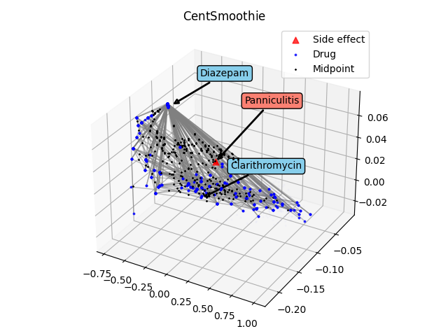

# CentSmoothie implementation

## Preparing environment

Create a python environment using anaconda
```shell
    conda env create -f pyv37.yml
    conda activate pyv37
    pip install pyaml
```
Install pytorch version 1.7.1 (1.7.0)
```shell
    conda install pytorch==1.7.1 torchvision==0.8.1 cudatoolkit=11.0 -c pytorch
```

Install torch geometric library

```shell
   pip install torch-scatter==latest+cu110 -f https://pytorch-geometric.com/whl/torch-1.7.0.html
   pip install torch-sparse==latest+cu110 -f https://pytorch-geometric.com/whl/torch-1.7.0.html
   pip install torch-cluster==latest+cu110 -f https://pytorch-geometric.com/whl/torch-1.7.0.html
   pip install torch-spline-conv==latest+cu110 -f https://pytorch-geometric.com/whl/torch-1.7.0.html
   pip install torch-geometric
```

## Command

### Generating K-Fold data:

```shell
   python main.py -z
```

### Running CentSmoothie:

```shell
  python main.py -r
```
### Visualization:

```shell
 python main.py -r -v
```

### Visualization results

